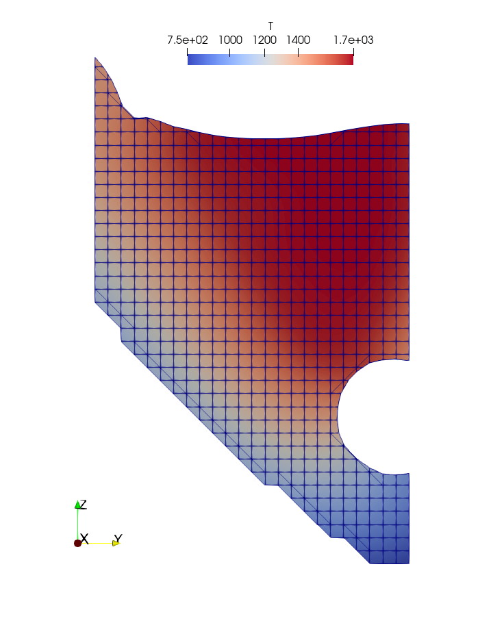
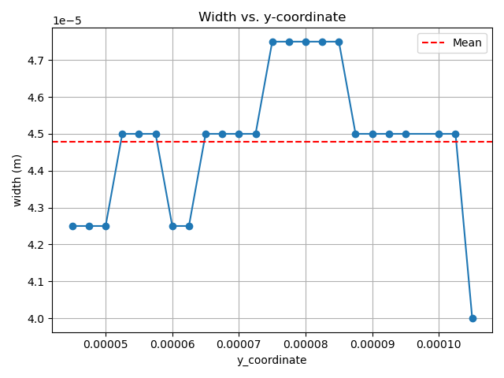
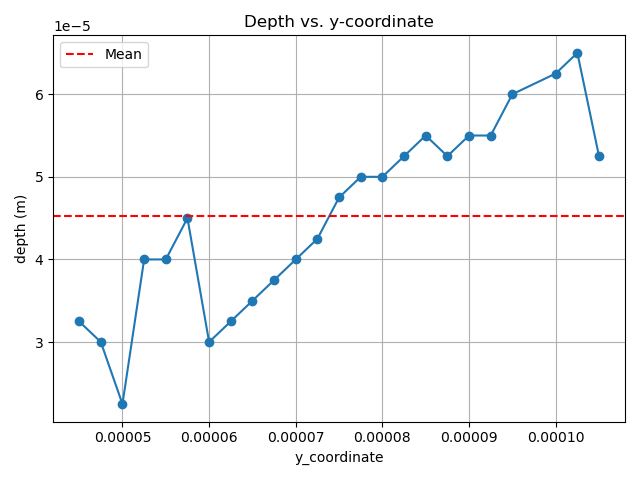
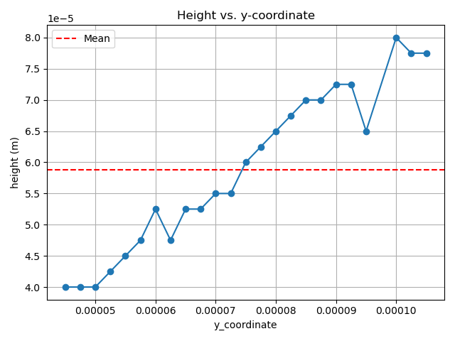
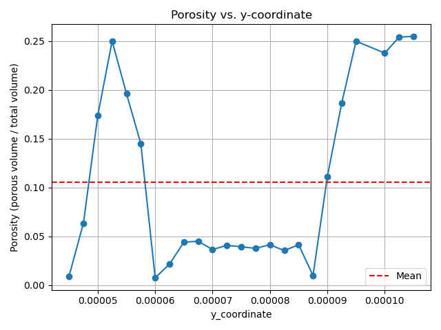

# Melt Pool Post-Processing Utility for laserbeamFoam

## Description

This utility provides a streamlined post-processing workflow to **calculate the melt pool geometry and porosity** from *laserbeamFoam* simulations.  
It automatically extracts the melt pool region from ParaView output and computes the **width**, **depth**, **height**, and **porosity** for every cross-section along the scanning direction.  
The tool is designed for batch use and supports reproducible analysis across multiple simulation cases.

## How to Use It

1. **Copy the Python scripts** from this repository into the folder containing the results of your *laserbeamFoam* simulation (the folder must include the `main.foam` file).  

2. **Activate the provided Conda environment** (or ensure that the required Python packages are installed).  

3. **Run the main script** from a terminal:
   ```bash
   python characterise_meltpool.py
   ```

## Prerequisites

### Software
- **OpenFOAM v2412** (or compatible), with the environment initialised.
- **ParaView ≥ 5.7**, with `pvpython` available on your `PATH`.
- **Conda** to create the Python environment from the supplied YAML.

### Python libraries
All Python dependencies are provided in the environment file (e.g. `environment.yml`).  
Create and activate the environment:

```bash
# Using conda
conda env create -f environment.yml
conda activate meltpool-postproc
```

After completion, the main results and plots (if enabled) will appear in the same folder as the scripts.


## How It Works

The workflow performs a fully automated analysis of the simulated melt pool geometry.  
It proceeds through the following stages:

1. **Continuity Check**  
   The program first performs a *mesh-aware continuity check* to verify that the simulated melt track is continuous along the scanning direction.  
   If any expected cross-section contains no material cells, the track is marked as discontinuous and no further processing is performed.

## Continuity Check — Illustration

<p align="center">
  
</p>

**Figure 1.** Example mid-plane slice used for the continuity check.  
Even though a **pore** is present (void region), the track is considered **continuous** because, for every expected cross-section along the scanning direction, there is melt material present (i.e., no fully void cross-sections).  
In other words, **local porosity does not break continuity** as long as each y-location still contains material cells.


2. **Cross-Section Analysis**  
   For a continuous track, the code analyses every cross-section (in the y-direction) of the melt pool and computes the following geometrical metrics:
   - **Width (W):** the maximum horizontal extent of the melt pool.  
   - **Height (H):** the vertical extent of the melt pool above the substrate.  
   - **Depth (D):** the penetration depth of the melt pool below the reference surface.  
   - **Porosity:** the ratio of pore volume to total volume within each cross-section.

3. **Output Generation**  
   The computed metrics are written to a CSV file named **`cross_sections_statistics.csv`**.  

## Optional Output Plots

If the option `PLOT_GEOMETRY_VS_Y_LOCATION = True` is enabled in `input_data.py`,  
the program automatically generates a set of plots showing how each melt pool metric varies along the *y*-direction (the laser scanning path).

<p align="center">
  
  
</p>

<p align="center">
  
  
</p>

**Figure 2.** Example plots automatically generated by the post-processing tool.  
Each plot displays the measured quantity (Width, Depth, Height, or Porosity) versus the *y*-coordinate of the track.  
The dashed red line indicates the mean value across all analysed cross-sections.

> These figures are optional, but they provide an excellent visual summary of the melt pool geometry and its variation along the scanning path.


This process enables rapid, reproducible quantification of melt pool geometry directly from *laserbeamFoam* simulation results.

## Example Case Included in This Folder

Although this folder is primarily intended to contain only the Python post-processing scripts,  
it also includes the results of a **small LPBF (Laser Powder Bed Fusion) simulation case**.  
This minimal case has been added purely for demonstration purposes — to illustrate how the tool is used  
and to showcase the type of outputs it produces (e.g. continuity slice, width, height, depth, and porosity plots).

## Limitations

The current version of this post-processing utility has several important limitations that users should be aware of:

1. **Energy source orientation**  
   The tool assumes that the laser energy source acts on the **x–y plane**.  
   Consequently, the analysis of cross-sections and continuity is performed along the **y-direction**.  
   Other beam orientations are not yet supported.  
   Future versions aim to remove this restriction and allow arbitrary scanning directions.

2. **VOF cells and fractional volumes**  
   Cells partially filled due to the **Volume of Fluid (VOF)** treatment are currently **ignored** in the calculations.  
   Their contribution is assumed negligible compared to the bulk melt pool cells, which are uniform and dominate the overall geometry.

3. **Discontinuous tracks**  
   If the melt track is found to be **non-continuous**, it is automatically **discarded** from further analysis.  
   No geometrical quantities are computed or plotted in such cases, since sections without any material make it impossible to define width, height, depth, or porosity consistently.

4. **Mesh uniformity assumption**  
   The method assumes a **regular mesh with uniform cell spacing**.  
   Strongly non-uniform or adaptive meshes may introduce numerical inconsistencies in the calculated metrics.

These limitations reflect the current implementation, which prioritises robustness and simplicity for typical LPBF single-track simulations.  
Planned future updates will relax several of these constraints to support more general use cases.

## Credits

This post-processing utility was developed as part of a collaborative research effort between  
**University College Dublin (UCD)** and the **University of Manchester (UoM)**.

**Authors:**
- **Simon A. Rodriguez**, University College Dublin (UCD)  
- **Petar Cosic**, University College Dublin (UCD)  
- **Tom Flint**, University of Manchester (UoM)  
- **Philip Cardiff**, University College Dublin (UCD)

The authors gratefully acknowledge the support of both institutions and the open-source communities of **OpenFOAM** and **ParaView**, whose tools made this workflow possible.

*Note:* This post-processing utility was developed as part of a larger research effort focused on automated LPBF simulation and analysis workflows.  
It may later be integrated into the broader **SimToPC** framework (Rodriguez et al., in preparation).
